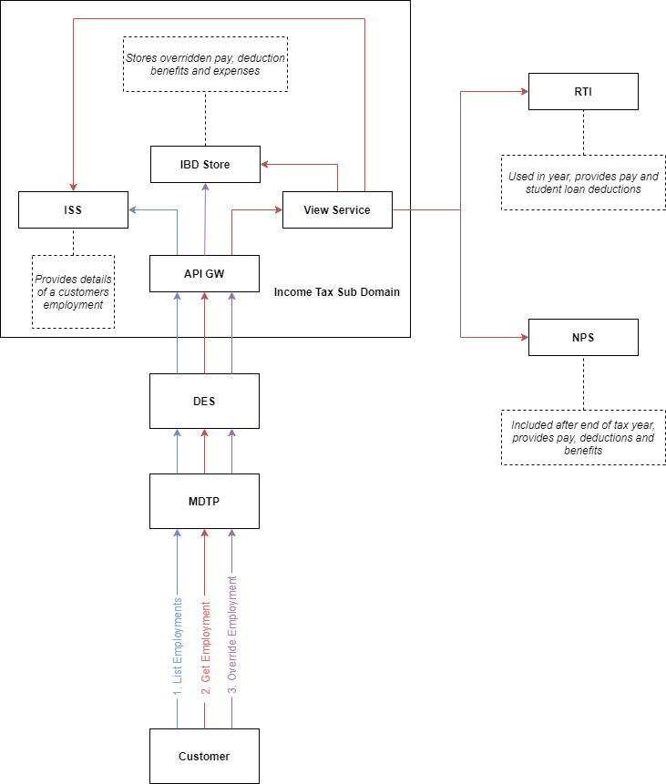

# Employments API Design Doc

## Decisions

| Ref  | Decision                                                     | Rationale                                                    |
| :---: | :----------------------------------------------------------- | :----------------------------------------------------------- |
|  1   | Customers will need to access each employment individually   | Overrides are considered a replacement, this would mean that either the customer would need to submit all fields across all employments even if they were only changing one field this will create a poor customer journey |
|  2   | Each employment will be assigned a ITSD specific (unique) reference | Historic problems with encoding employer references drives us to avoid using it with payroll id as the unique identifier, therefore when an employment is created in the sub domain a unique id will be assigned to it |
|  3   | Customers will need to list their employments first via a GET API | As a consequence of decision 1 we will need to allow customers to retrieve their Ids before they can interact at employment level. |
|  4   | Employments will be retrieved via the _employment id_        | As per decision 3                                            |
|  5   | Customers will need to supply the complete resource when overriding | Consistent with other annual processing, regardless of how many data items within an employment a customer wants to override they will need to supply a complete resource, this moves the burden of delta processing to the 3pp |
|  6   | Customers cannot override the employer details               | This would be akin to creating a new employment and would need to follow a different route |
|  7   | Delete operation only deletes overrides                      | You can't delete RTI employments                             |
|  8   | If a delete operation occurs without an override it will return a 404 | You can only delete an override - In this scenario the override won't be found in IBD hence the 404. |


\newpage 

## Issues

| Ref  | Description                                                  | Assigned To                             | Resolution                                                   |
| :---: | :----------------------------------------------------------- | :-------------------------------------- | :----------------------------------------------------------- |
|  1   | If we allow a customer to create an employment via their 3pp do we create an inconsistent view of employments, does the ISS need to be informed etc. | Heidi Griffiths                         |                                                              |
|  2   | How does a customer "delete" a pre-pop employment if they don't believe its valid | Group                                   | Customer will be able to submit an ignore override for the tax year. They cannot delete an RTI employment. |
|  3   | Student Loans can be updated via 3pp and Student Loans service. Student loans service will only provide the updated deduction not the whole employment how is this being managed from a technical perspective | Ashleigh Carr, Jon Elliott, Tim Simpson |                                                              |
|  4   | Expenses will not be pre-populated - do these need to be a dedicated endpoint |                                         |                                                              |
|  5   | Row #44 Foreign tax for which tax credit relief not claimed - is this not covered in Reliefs? |  Heidi/SME to advise |  |
|  6   | Rows #35-36 Class 2 and Class 4 National Insurance Contributions (NICs) - no class 2 details | Heidi/SME to advise |  |
|  7   | Expenses: check for employment before submitting? Include employment expenses in /expenses API? Cumulative/YTD totals? | Group |  |

\newpage

## Assumptions

| Ref  | Assumption                                                   | Clarification |
| ---- | ------------------------------------------------------------ | ------------- |
| 1    | An "ignored" employment will still be returned a part of the list of employments |               |
| 2    | An "ignored" employment when retrieved will be clearly marked as ignored but the latest finanical data for the employment will also be returned |               |

\newpage

 
## Change Log

| Version | Date | Author | Comments                                         |
| ------- | ---------- | --- | ------------------------------------------------ |
| 1.0     | 20/05/2020 | Jon Elliot |Initial version looking at Employments retrieval |
| 1.1      | 21/05/2020 | Jon Elliot |Refined the retrieval of employments by expanding the data fields |
| 1.2 | 22/05/2020 | Jon Elliot |Added new issues from design session, updated schemata for list employments and get employment. Added delete operation. Added dateIgnored to represent the date the customer requested HMRC ignored a customer. |
| 1.3      | 22/05/2020 | Toby Porter | Added Lump Sums, Pensions, Annuities & NICs |
  
\newpage

## Context Diagram 



\newpage

## APIs

### Get Employments

#### Description

List all employments that are associated with the supplied taxable entity id and tax year combination that have been active in the tax year.

#### ITSD Realisation

This API will be realised by the ISS. 

#### URI

_/income/employments/{taxableEntityId}/{taxYear}_

#### Parameters

| Parameter       | Description                      | Example |
|:----------------|:---------------------------------|:--------|
| taxableEntityId | Unique customer identifier       | AB123456|
| taxYear         | The tax year to search within    | 2019-20 |


#### Request Payload Example

N/A

#### Response Payload Schema

```json
{
  "$id": "https://www.gov.uk/government/organisations/hm-revenue-customs/schema/itsa/list_employments_response",
  "$schema": "http://json-schema.org/draft-07/schema#",
  "title": "List Employments Schema",
  "type": "object",
  "properties": {
    "employments": {
      "type": "array",
      "items": {
        "$ref": "#/definitions/employment"
      },
      "additionalItems": false,
      "minItems": 1
    }
  },
  "minProperties": 1,
  "additionalProperties": false,
  "examples": [
    {
      "employments":[
        { 
          "employmentId" : "960b4a0f-05f2-4b6f-9b87-c3e001a84472",
          "employerName" : "Wibble Inc",
          "employerRef"  : "123/XX12345",
          "dateIgnored": "2020-01-01T01:01:01Z"
        },
        { 
          "employmentId" : "960b4a0f-05f2-4b6f-9b87-c3e001a84472",
          "employerName" : "Wibble Inc",
          "employerRef"  : "123/XX12345",
          "payrollId"    : "12344323434323"
        },    
      ]
    }
  ],
  "definitions": {
    "employmentId": {
      "id": "#employmentId",
      "type": "string",
      "description": "Unique identifier assigned to an employment",
      "pattern": "^[0-9a-f]{8}-[0-9a-f]{4}-[1-5][0-9a-f]{3}-[89ab][0-9a-f]{3}-[0-9a-f]{12}$",
      "format": "uuid"
    },
    "employerRef": {
      "id": "#employerRef",
      "type": "string",
      "pattern": "^([0-9]{3})/([^ ].{0,10})$",
      "description":"Unique identifier of the emp;oyer"
    },
    "employerName": {
      "id": "#employerName",
      "type": "string",
      "pattern": "^.{0,74}$",
      "description": "The name of the employer"
    },
    "payrollId": {
      "id": "#payrollId",
      "type": "string",
      "pattern": "^[a-zA-Z0-9]{0,74}$",
      "description": "The unique identifer of the employment from the employer."
    },
    "employment": {
      "id": "#employment",
      "type": "object",
      "description": "An employment object",
      "properties": {
        "employmentId": {
          "$ref": "#/definitions/employmentId"
        },
        "employerRef": {
          "$ref": "#/definitions/employerRef"
        },
        "employerName": {
          "$ref": "#/definitions/employerName"
        },
        "payrollId": {
          "$ref": "#/definitions/payrollId"
        },
        "dateIgnored": {
          "type":"string",
          "format": "date-time",
          "description": "The date the customer asked HMRC to ignore the employment"
        }
      },
      "additionalProperties": false,
      "required": [
        "employmentId",
        "employerName",
        "employerRef"
      ]
    }
  }
}
```

#### Response Payload Example

```json
{
  "employments":[
    { 
      "employmentId" : "960b4a0f-05f2-4b6f-9b87-c3e001a84472",
      "employerName" : "Wibble Inc",
      "employerRef"  : "123/XX12345",
      "dateIgnored"  : "2020-01-01T01:01:01Z"
    },
    { 
      "employmentId" : "960b4a0f-05f2-4b6f-9b87-c3e001a84472",
      "employerName" : "Wibble Inc",
      "employerRef"  : "123/XX12345",
      "payrollId"    : "12344323434323"
    },    
  ]
}
```

##### Response Payload Notes

* The id assigned to each employment is specific to the Income Tax Sub Domain (i.e. it doesn't come from RTI)
* The payroll Id is optional
* dateIgnored represents the date the customer asked HMRC to ignore the employment. 

#### Response Codes

| Response Code | Description          |
|:--------------|:---------------------|
| 200           | Success              |
| 400           | Parameter error      |
| 401           | Unauthorised         |
| 404           | No data found        |
| 502           | Glitch in the matrix |

\newpage

### Get Employment

#### Description
Retrieve the financial details of a specific Employment by ID

#### ITSD Realisation

This API will be realised by the View Service, the employer and employment information will be sourced from the ISS whilst the financial details of the employment will be sourced from a combination of RTI, NPS and IBD Store. 

#### URI

_/income/employments/{taxableEntityId}/{taxYear}/{employmentId}_

#### Parameters

| Parameter       | Description                      | Example                              |
|:----------------|:---------------------------------|:-------------------------------------|
| taxableEntityId | Unique customer identifier       | AB123456                             |
| taxYear         | The tax year to search within    | 2019-20                              |
| employmentId    | Unique employment identifer      | 123e4567-e89b-12d3-a456-426614174000 |


#### Request Payload Example

N/A

#### Response Payload Schema

```json
{
  "$id": "https://www.gov.uk/government/organisations/hm-revenue-customs/schema/itsa/Get_Employment_Response",
  "$schema": "http://json-schema.org/draft-07/schema#",
  "title": "Get Employment Response",
  "type": "object",
  "additionalProperties": false,
  "minProperties": 5,
  "required": [
    "employer",
    "employment",
    "submittedOn",
    "source"
  ],
  "properties": {
    "submittedOn": {
      "type": "string",
      "format": "date-time"
    },
    "source": {
      "type": "string",
      "enum": [
        "CUSTOMER",
        "EMPLOYER",
        "HMRC"
      ]
    },
    "dateIgnored":{ 
      "type":"string",
      "format":"date-time"
    },
    "employer": {
      "$ref": "#/definitions/employer"
    },
    "employment": {
      "$ref": "#/definitions/employment"
    },
    "pay": {
      "$ref": "#/definitions/pay"
    },
    "deductions": {
      "$ref": "#/definitions/deductions"
    },
    "benefits": {
      "$ref": "#/definitions/benefits"
    },
    "expenses": {
      "$ref": "#/definitions/expenses"
    }
  },
  "definitions": {
    "employerRef": {
      "id": "#employerRef",
      "type": "string",
      "pattern": "^([0-9]{3})/([^ ].{0,10})$"
    },
    "employerName": {
      "id": "#employerName",
      "type": "string",
      "pattern": "^.{0,74}$"
    },
    "moneyPositive": {
      "$id": "#moneyPositive",
      "description": "Definition of a positive money value",
      "type": "number",
      "multipleOf": 0.01,
      "minimum": 0,
      "maximum": 99999999.99
    },
    "payrollId": {
      "id": "#payrollId",
      "type": "string",
      "pattern": "^[a-zA-Z0-9]{0,74}$"
    },
    "employer": {
      "id": "#employer",
      "type": "object",
      "properties": {
        "employerRef": {
          "$ref": "#/definitions/employerRef"
        },
        "employerName": {
          "$ref": "#/definitions/employerName"
        }
      },
      "additionalProperties": false,
      "required": [
        "employerName",
        "employerRef"
      ]
    },
    "employment": {
      "id": "#employment",
      "type": "object",
      "properties": {
        "payrollId": {
          "$ref": "#/definitions/payrollId"
        },
        "companyDirector": {
          "type": "boolean"
        },
        "closeCompany": {
          "type": "boolean"
        },
        "directorshipCeasedDate": {
          "type": "string",
          "format": "date"
        },
        "startDate": {
          "type": "string",
          "format": "date"
        },
        "cessationDate": {
          "type": "string",
          "format": "date"
        },
        "occupationalPension": {
          "type": "boolean"
        }
      },
      "additionalProperties": false,
      "required": [
        "startDate"
      ],
      "minProperties": 1
    },
    "pay": {
      "id": "#pay",
      "type": "object",
      "properties": {
        "grossAmountPaidYtd": {
          "$ref": "#/definitions/moneyPositive"
        },
        "taxTakenOffYtd": {
          "$ref": "#/definitions/moneyPositive"
        },
        "tipsAndOtherPayments": {
          "$ref": "#/definitions/moneyPositive"
        },
        "payFrequency": {
          "type": "string",
          "enum": [
            "WEEKLY",
            "FORTNIGHTLY",
            "FOUR WEEKLY",
            "CALENDAR MONTHLY",
            "QUARTERLY",
            "BI-ANNUALLY",
            "ONE-OFF",
            "IRREGULAR",
            "ANNUALLY"
          ]
        },
        "paymentDate": {
          "type": "string",
          "format": "date"
        },
        "taxWeekNo": {
          "type": "number",
          "minimum": 1,
          "maxumum": 52
        },
        "taxMonthNo": {
          "type": "number",
          "minimum": 1,
          "maxumum": 13
        }
      },
      "additionalProperties": false,
      "oneOf": [
        {
          "required": [
            "payFrequency",
            "paymentDate",
            "taxWeekNo"
          ],
          "not": {
            "required": [
              "taxMonthNo"
            ]
          }
        },
        {
          "required": [
            "payFrequency",
            "paymentDate",
            "taxMonthNo"
          ],
          "not": {
            "required": [
              "taxWeekNo"
            ]
          }
        }
      ]
    },
    "studentLoans": {
      "id": "#studentLoans",
      "type": "object",
      "properties": {
        "uglDeductionAmount": {
          "$ref": "#moneyPositive"
        },
        "pglDeductionAmount": {
          "$ref": "#moneyPositive"
        }
      },
      "additionalProperties": false,
      "minProperties": 1
    },
    "deductions": {
      "id": "#deductions",
      "type": "object",
      "properties": {
        "studentLoans": {
          "$ref": "#/definitions/studentLoans"
        }
      },
      "additionalProperties": false,
      "minProperties": 1,
      "required": []
    },
    "benefits": {
      "id": "#benefits",
      "type": "object",
      "properties": {},
      "additionalProperties": false,
      "minProperties": 1,
      "required": []
    },
    "expenses": {
      "id": "#expenses",
      "type": "object",
      "properties": {
        "businessTravelCosts": {
          "$ref": "#moneyPositive"
        },
        "jobExpenses": {
          "$ref": "#moneyPositive"
        },
        "flatRateJobExpenses": {
          "$ref": "#moneyPositive"
        },
        "professionalSubscriptions": {
          "$ref": "#moneyPositive"
        },
        "hotelAndMealExpenses": {
          "$ref": "#moneyPositive"
        },
        "otherAndCapitalAllowances": {
          "$ref": "#moneyPositive"
        },
        "vehicleExpenses": {
          "$ref": "#moneyPositive"
        },
        "mileageAllowanceRelief": {
          "$ref": "#moneyPositive"
        }
      },
      "additionalProperties": false,
      "minProperties": 1,
      "required": []
    },
    "benefits": {
      "id": "#benefits",
      "type": "object",
      "properties": {
        "accommodation": {
          "$ref": "#moneyPositive"
        },
        "assets": {
          "$ref": "#moneyPositive"
        },
        "assetTransfer": {
          "$ref": "#moneyPositive"
        },
        "beneficialLoan": {
          "$ref": "#moneyPositive"
        },
        "car": {
          "$ref": "#moneyPositive"
        },
        "carFuel": {
          "$ref": "#moneyPositive"
        },
        "educationalServices": {
          "$ref": "#moneyPositive"
        },
        "entertaining": {
          "$ref": "#moneyPositive"
        },
        "expenses": {
          "$ref": "#moneyPositive"
        },
        "medicalInsurance": {
          "$ref": "#moneyPositive"
        },
        "telephone": {
          "$ref": "#moneyPositive"
        },
        "service": {
          "$ref": "#moneyPositive"
        },
        "taxableExpenses": {
          "$ref": "#moneyPositive"
        },
        "van": {
          "$ref": "#moneyPositive"
        },
        "vanFuel": {
          "$ref": "#moneyPositive"
        },
        "mileage": {
          "$ref": "#moneyPositive"
        },
        "nonQualifyingRelocationExpenses": {
          "$ref": "#moneyPositive"
        },
        "nurseryPlaces": {
          "$ref": "#moneyPositive"
        },
        "otherItems": {
          "$ref": "#moneyPositive"
        },
        "paymentsOnEmployeesBehalf": {
          "$ref": "#moneyPositive"
        },
        "personalIncidentalExpenses": {
          "$ref": "#moneyPositive"
        },
        "qualifyingRelocationExpenses": {
          "$ref": "#moneyPositive"
        },
        "employerProvidedProfessionalSubscriptions": {
          "$ref": "#moneyPositive"
        },
        "employerProvidedServices": {
          "$ref": "#moneyPositive"
        },
        "incomeTaxPaidByDirector": {
          "$ref": "#moneyPositive"
        },
        "travelAndSubsistence": {
          "$ref": "#moneyPositive"
        },
        "vouchersAndCreditCards": {
          "$ref": "#moneyPositive"
        },
        "nonCash": {
          "$ref": "#moneyPositive"
        }
      },
      "additionalProperties": false,
      "minProperties": 1,
      "required": []
    }
  },
  "examples": [
    {
      "submittedOn": "2019-04-04T01:01:01Z",
      "source": "CUSTOMER",
      "dateIgnored": "2019-04-04T01:01:01Z",
      "employer": {
        "employerRef": "123/XX12345",
        "employerName": "wibble"
      },
      "employment": {
        "payrollId": "124432423423",
        "companyDirector": true,
        "closeCompany": false,
        "directorshipCeasedDate": "2020-01-01",
        "startDate": "2019-01-01",
        "cessationDate": "2020-01-01",
        "occupationalPension": false,
        "disguisedRemuneration": false
      },
    "class2andClass4NicsContributions": {
        "exemptFromPayingClass4Nics": false,
        "adjustmentToProfitsChargeableToClass4Nics":  123.00
      },
      "pay": {
        "grossAmountPaidYtd": 1234.15,
        "taxTakenOffYtd": 12.22,
        "tipsAndOtherPayments": 10000.0,
        "payFrequency": "MONTHLY",
        "paymentDate": "2020-05-12",
        "taxWeekNo": 52,
        "taxMonthNo": 13
      },
      "deductions": {
        "studentLoans": {
          "uglDeductionAmount": 1232.22,
          "pglDeductionAmount": 1232.22
        }
      },
      "expenses": {
        "businessTravelCosts": 122.22,
        "jobExpenses": 124.22,
        "flatRateJobExpenses": 124.22,
        "professionalSubscriptions": 124.22,
        "hotelAndMealExpenses": 124.22,
        "otherAndCapitalAllowances": 123.12,
        "vehicleExpenses": 124.22,
        "mileageAllowanceRelief": 124.22
      },
      "benefits": {
        "accommodation": 124.22,
        "assets": 124.22,
        "assetTransfer": 124.22,
        "beneficialLoan": 124.22,
        "car": 124.22,
        "carFuel": 124.22,
        "educationalServices": 124.22,
        "entertaining": 124.22,
        "expenses": 124.22,
        "medicalInsurance": 124.22,
        "telephone": 124.22,
        "service": 124.22,
        "taxableExpenses": 124.22,
        "van": 124.22,
        "vanFuel": 124.22,
        "mileage": 124.22,
        "nonQualifyingRelocationExpenses": 124.22,
        "nurseryPlaces": 124.22,
        "otherItems": 124.22,
        "paymentsOnEmployeesBehalf": 124.22,
        "personalIncidentalExpenses": 124.22,
        "qualifyingRelocationExpenses": 124.22,
        "employerProvidedProfessionalSubscriptions": 124.22,
        "employerProvidedServices": 124.22,
        "incomeTaxPaidByDirector": 124.22,
        "travelAndSubsistence": 124.22,
        "vouchersAndCreditCards": 124.22,
        "nonCash": 124.22
      }
    },
  "pensions": [
    {
    "payeTaxReferenceOfPensionProvider": "123/XX12345",
    "grossAmountPaid": 123.00,
    "taxTakenOff": 123.00
    }
  ],
  "annuities": [
    {
      "payeTaxReferenceOfAnnuityProvider": "123/XX12345",
      "grossAmountPaid": 123.00,
      "taxTakenOff": 123.00
    }
  ],
  "lumpSums": {
     "compensationAndLumpSumsUpto30kExemption": 123.00,
     "compensationAndLumpSumsAbove30kExemption": 123.00,
     "pensionLumpSums": [
      {
        "payeTaxReferenceOfLumpSumProvider": "123/XX12345",
        "taxableLumpSumTreatedAsPension": 123.00,
        "taxTakenOff": 123.00
      }
    ],
    "taxableLumpSumsAfterTheEndofJob": [
      {
        "payeTaxReferenceOfLumpSumProvider": "123/XX12345",
        "grossAmountPaid": 123.00,
        "taxTakenOff": 123.00,
        "taxIncludedInEmploymentIncome": true
      }
    ],
    "EmployerFinancedRetirementBenefitsScheme": [
      {
        "payeTaxReferenceOfLumpSumProvider": "123/XX12345",
        "grossAmountPaid": 123.00,
        "taxTakenOff": 123.00,
        "taxIncludedInEmploymentIncome": true,
        "exemptionsForAmountEnteredForLumpSum": 123.00
      }
    ],
    "RedundancyOtherLumpSumsAndCompensationPayments": [
      {
        "payeTaxReferenceOfLumpSumProvider": "123/XX12345",
        "grossAmountPaid": 123.00,
        "taxTakenOff": 123.00,
        "taxIncludedInEmploymentIncome": true
      }
    ]
  }
]

```

#### Response Payload Example (Not Ignored By Customer)

```json
{
  "submittedOn": "2019-04-04T01:01:01Z",
  "source": "CUSTOMER",
  "employer": {
    "employerRef": "123/XX12345",
    "employerName": "wibble"
  },
  "employment": {
    "payrollId": "124432423423",
    "companyDirector": true,
    "closeCompany": false,
    "directorshipCeasedDate": "2020-01-01",
    "startDate": "2019-01-01",
    "cessationDate": "2020-01-01",
    "occupationalPension": false
  },
  "pay": {
    "grossAmountPaidYtd": 1234.15,
    "taxTakenOffYtd": 12.22,
    "tipsAndOtherPayments": 10000.0,
    "payFrequency": "CALENDAR MONTHLY",
    "paymentDate": "2020-05-12",
    "taxWeekNo": 52
  },
  "deductions": {
    "studentLoans": {
      "uglDeductionAmount": 1232.22,
      "pglDeductionAmount": 1232.22
    }
  },
  "expenses": {
    "businessTravelCosts": 122.22,
    "jobExpenses": 124.22,
    "flatRateJobExpenses": 124.22,
    "professionalSubscriptions": 124.22,
    "hotelAndMealExpenses": 124.22,
    "otherAndCapitalAllowances": 123.12,
    "vehicleExpenses": 124.22,
    "mileageAllowanceRelief": 124.22
  },
  "benefits": {
    "accommodation": 124.22,
    "assets": 124.22,
    "assetTransfer": 124.22,
    "beneficialLoan": 124.22,
    "car": 124.22,
    "carFuel": 124.22,
    "educationalServices": 124.22,
    "entertaining": 124.22,
    "expenses": 124.22,
    "medicalInsurance": 124.22,
    "telephone": 124.22,
    "service": 124.22,
    "taxableExpenses": 124.22,
    "van": 124.22,
    "vanFuel": 124.22,
    "mileage": 124.22,
    "nonQualifyingRelocationExpenses": 124.22,
    "nurseryPlaces": 124.22,
    "otherItems": 124.22,
    "paymentsOnEmployeesBehalf": 124.22,
    "personalIncidentalExpenses": 124.22,
    "qualifyingRelocationExpenses": 124.22,
    "employerProvidedProfessionalSubscriptions": 124.22,
    "employerProvidedServices": 124.22,
    "incomeTaxPaidByDirector": 124.22,
    "travelAndSubsistence": 124.22,
    "vouchersAndCreditCards": 124.22,
    "nonCash": 124.22
  },
  "pensions": [
    {
    "payeTaxReferenceOfPensionProvider": "123/XX12345",
    "grossAmountPaid": 123.00,
    "taxTakenOff": 123.00
    }
  ],
  "annuities": [
    {
      "payeTaxReferenceOfAnnuityProvider": "123/XX12345",
      "grossAmountPaid": 123.00,
      "taxTakenOff": 123.00
    }
  ],
  "lumpSums": {
     "compensationAndLumpSumsUpto30kExemption": 123.00,
     "compensationAndLumpSumsAbove30kExemption": 123.00,
     "pensionLumpSums": [
      {
        "payeTaxReferenceOfLumpSumProvider": "123/XX12345",
        "taxableLumpSumTreatedAsPension": 123.00,
        "taxTakenOff": 123.00
      }
    ],
    "taxableLumpSumsAfterTheEndofJob": [
      {
        "payeTaxReferenceOfLumpSumProvider": "123/XX12345",
        "grossAmountPaid": 123.00,
        "taxTakenOff": 123.00,
        "taxIncludedInEmploymentIncome": true
      }
    ],
    "EmployerFinancedRetirementBenefitsScheme": [
      {
        "payeTaxReferenceOfLumpSumProvider": "123/XX12345",
        "grossAmountPaid": 123.00,
        "taxTakenOff": 123.00,
        "taxIncludedInEmploymentIncome": true,
        "exemptionsForAmountEnteredForLumpSum": 123.00
      }
    ],
    "RedundancyOtherLumpSumsAndCompensationPayments": [
      {
        "payeTaxReferenceOfLumpSumProvider": "123/XX12345",
        "grossAmountPaid": 123.00,
        "taxTakenOff": 123.00,
        "taxIncludedInEmploymentIncome": true
      }
    ]
}
```

#### Response Payload Example (Ignored By Customer)

```json
{
  "submittedOn": "2019-04-04T01:01:01Z",
  "source": "CUSTOMER",
  "dateIgnored": "2019-04-04T01:01:01Z",
  "employer": {
    "employerRef": "123/XX12345",
    "employerName": "wibble"
  },
  "employment": {
    "payrollId": "124432423423",
    "companyDirector": true,
    "closeCompany": false,
    "directorshipCeasedDate": "2020-01-01",
    "startDate": "2019-01-01",
    "cessationDate": "2020-01-01",
    "occupationalPension": false
  },
  "pay": {
    "grossAmountPaidYtd": 1234.15,
    "taxTakenOffYtd": 12.22,
    "tipsAndOtherPayments": 10000.0,
    "payFrequency": "CALENDAR MONTHLY",
    "paymentDate": "2020-05-12",
    "taxWeekNo": 52
  },
  "deductions": {
    "studentLoans": {
      "uglDeductionAmount": 1232.22,
      "pglDeductionAmount": 1232.22
    }
  },
  "expenses": {
    "businessTravelCosts": 122.22,
    "jobExpenses": 124.22,
    "flatRateJobExpenses": 124.22,
    "professionalSubscriptions": 124.22,
    "hotelAndMealExpenses": 124.22,
    "otherAndCapitalAllowances": 123.12,
    "vehicleExpenses": 124.22,
    "mileageAllowanceRelief": 124.22
  },
  "benefits": {
    "accommodation": 124.22,
    "assets": 124.22,
    "assetTransfer": 124.22,
    "beneficialLoan": 124.22,
    "car": 124.22,
    "carFuel": 124.22,
    "educationalServices": 124.22,
    "entertaining": 124.22,
    "expenses": 124.22,
    "medicalInsurance": 124.22,
    "telephone": 124.22,
    "service": 124.22,
    "taxableExpenses": 124.22,
    "van": 124.22,
    "vanFuel": 124.22,
    "mileage": 124.22,
    "nonQualifyingRelocationExpenses": 124.22,
    "nurseryPlaces": 124.22,
    "otherItems": 124.22,
    "paymentsOnEmployeesBehalf": 124.22,
    "personalIncidentalExpenses": 124.22,
    "qualifyingRelocationExpenses": 124.22,
    "employerProvidedProfessionalSubscriptions": 124.22,
    "employerProvidedServices": 124.22,
    "incomeTaxPaidByDirector": 124.22,
    "travelAndSubsistence": 124.22,
    "vouchersAndCreditCards": 124.22,
    "nonCash": 124.22
  }
}
```
##### Response Payload Notes

* submittedOn is mandatory
* submittedOn either FPS date or the customer override submission date. 
* source will either be CUSTOMER or EMPLOYER or HMRC?
* source will be mandatory
* employer.employerRef is mandatory
* employer.employerName is mandatory
* employment.companyDirector = not pre-pop
* employment.closeCompany = not pre-pop
* employment.directorshipCeasedDate = not pre-pop
* employment.occupationalPension is optional lack of = false
* pay.payFrequency = WEEKLY, FORTNIGHTLY, 4 WEEKLY, CALENDAR MONTHLY, QUARTERLY, BI-ANNUALLY, ONE-OFF, IRREGULAR ,ANNUALLY
* pay.grossAmountPaidYtd is optional
* pay.grossAmountPaidYtd increments of 1p
* pay.taxTakenOffYtd is optional
* pay.taxTakenOffYtd increments of 1p
* pay.tipsAndOtherPayments is optional
* pay.tipsAndOtherPayments must be positive
* pay.tipsAndOtherPayments increments of 1p
* pay.paymentDate is mandatory (check)
* pay.taxWeekNo is conditional (depends on Pay frequency)
* pay.taxMonthNo is conditional (depends on Pay Frequency)
* pay.taxWeekNo and pay.TaxMonthNo are mutually exclusive
* Deductions - must be at least one property for this object to exist
* Expenses - must be at least one property for this object to exist
* Expenses - must be positive
* Expenses - increments of 1p
* Benefits - must be at least one property for this object to exist
* Benefits - must be positive 
* Benefits - increments of 1p
* dateIgnored will be returned if the customer has requested the employment is ignored by HMRC - this is the date the customer requested that HMRC ignored the employment

#### Response Codes

| Response Code | Description          |
|:--------------|:---------------------|
| 200           | Success              |
| 400           | Parameter error      |
| 401           | Unauthorised         |
| 404           | No data found        |
| 502           | Glitch in the matrix |

\newpage

### Override Employment (PUT)

#### Description

Override the financial details of an employment. A customer can indicate the wish to ignore an employment by submitting an ignore flag.

#### ITSD Realisation

This API will be realised by the IBD Store

#### URI

_/income/employments/{taxbleEntityId}/{taxYear}/{employmentId}_

#### Parameters

| Parameter       | Description                      | Example                              |
|:----------------|:---------------------------------|:-------------------------------------|
| taxableEntityId | Unique customer identifier       | AB123456                             |
| taxYear         | The tax year to search within    | 2019-20                              |
| employmentId    | Unique employment identifer      | 123e4567-e89b-12d3-a456-426614174000 |

#### Request Payload Schema 

```json
{
  "$id": "https://www.gov.uk/government/organisations/hm-revenue-customs/schema/itsa/Put_Employment_Request",
  "$schema": "http://json-schema.org/draft-07/schema#",
  "title": "PUT Employment Request",
  "type": "object",
  "oneOf": [
    {
      "type": "object",
      "properties": {
        "employment": {
          "$ref": "#/definitions/employment"
        },
        "pay": {
          "$ref": "#/definitions/pay"
        },
        "deductions": {
          "$ref": "#/definitions/deductions"
        },
        "benefits": {
          "$ref": "#/definitions/benefits"
        },
        "expenses": {
          "$ref": "#/definitions/expenses"
        }
      },
      "additionalProperties": false,
      "minProperties": 1
    },
    {
      "type": "object",
      "properties": {
        "ignoreEmployment": {
          "type": "string",
          "enum": [
            "true"
          ]
        }
      },
      "additionalProperties":false,
      "required": [
        "ignoreEmployment"
      ]
    }
  ],
  "definitions": {
    "employerRef": {
      "id": "#employerRef",
      "type": "string",
      "pattern": "^([0-9]{3})/([^ ].{0,10})$"
    },
    "employerName": {
      "id": "#employerName",
      "type": "string",
      "pattern": "^.{0,74}$"
    },
    "moneyPositive": {
      "$id": "#moneyPositive",
      "description": "Definition of a positive money value",
      "type": "number",
      "multipleOf": 0.01,
      "minimum": 0,
      "maximum": 99999999.99
    },
    "payrollId": {
      "id": "#payrollId",
      "type": "string",
      "pattern": "^[a-zA-Z0-9]{0,74}$"
    },
    "employment": {
      "id": "#employment",
      "type": "object",
      "properties": {
        "payrollId": {
          "$ref": "#/definitions/payrollId"
        },
        "companyDirector": {
          "type": "boolean"
        },
        "closeCompany": {
          "type": "boolean"
        },
        "directorshipCeasedDate": {
          "type": "string",
          "format": "date"
        },
        "startDate": {
          "type": "string",
          "format": "date"
        },
        "cessationDate": {
          "type": "string",
          "format": "date"
        },
        "occupationalPension": {
          "type": "boolean"
        }
      },
      "additionalProperties": false,
      "required": [
        "startDate"
      ],
      "minProperties": 1
    },
    "pay": {
      "id": "#pay",
      "type": "object",
      "properties": {
        "grossAmountPaidYtd": {
          "$ref": "#/definitions/moneyPositive"
        },
        "taxTakenOffYtd": {
          "$ref": "#/definitions/moneyPositive"
        },
        "tipsAndOtherPayments": {
          "$ref": "#/definitions/moneyPositive"
        },
        "payFrequency": {
          "type": "string",
          "enum": [
            "WEEKLY",
            "FORTNIGHTLY",
            "FOUR WEEKLY",
            "CALENDAR MONTHLY",
            "QUARTERLY",
            "BI-ANNUALLY",
            "ONE-OFF",
            "IRREGULAR",
            "ANNUALLY"
          ]
        },
        "paymentDate": {
          "type": "string",
          "format": "date"
        },
        "taxWeekNo": {
          "type": "number",
          "minimum": 1,
          "maxumum": 52
        },
        "taxMonthNo": {
          "type": "number",
          "minimum": 1,
          "maxumum": 13
        }
      },
      "additionalProperties": false,
      "oneOf": [
        {
          "required": [
            "payFrequency",
            "paymentDate",
            "taxWeekNo"
          ],
          "not": {
            "required": [
              "taxMonthNo"
            ]
          }
        },
        {
          "required": [
            "payFrequency",
            "paymentDate",
            "taxMonthNo"
          ],
          "not": {
            "required": [
              "taxWeekNo"
            ]
          }
        }
      ]
    },
    "studentLoans": {
      "id": "#studentLoans",
      "type": "object",
      "properties": {
        "uglDeductionAmount": {
          "$ref": "#moneyPositive"
        },
        "pglDeductionAmount": {
          "$ref": "#moneyPositive"
        }
      },
      "additionalProperties": false,
      "minProperties": 1
    },
    "deductions": {
      "id": "#deductions",
      "type": "object",
      "properties": {
        "studentLoans": {
          "$ref": "#/definitions/studentLoans"
        }
      },
      "additionalProperties": false,
      "minProperties": 1,
      "required": []
    },
    "expenses": {
      "id": "#expenses",
      "type": "object",
      "properties": {
        "businessTravelCosts": {
          "$ref": "#moneyPositive"
        },
        "jobExpenses": {
          "$ref": "#moneyPositive"
        },
        "flatRateJobExpenses": {
          "$ref": "#moneyPositive"
        },
        "professionalSubscriptions": {
          "$ref": "#moneyPositive"
        },
        "hotelAndMealExpenses": {
          "$ref": "#moneyPositive"
        },
        "otherAndCapitalAllowances": {
          "$ref": "#moneyPositive"
        },
        "vehicleExpenses": {
          "$ref": "#moneyPositive"
        },
        "mileageAllowanceRelief": {
          "$ref": "#moneyPositive"
        }
      },
      "additionalProperties": false,
      "minProperties": 1,
      "required": []
    },
    "benefits": {
      "id": "#benefits",
      "type": "object",
      "properties": {
        "accommodation": {
          "$ref": "#moneyPositive"
        },
        "assets": {
          "$ref": "#moneyPositive"
        },
        "assetTransfer": {
          "$ref": "#moneyPositive"
        },
        "beneficialLoan": {
          "$ref": "#moneyPositive"
        },
        "car": {
          "$ref": "#moneyPositive"
        },
        "carFuel": {
          "$ref": "#moneyPositive"
        },
        "educationalServices": {
          "$ref": "#moneyPositive"
        },
        "entertaining": {
          "$ref": "#moneyPositive"
        },
        "expenses": {
          "$ref": "#moneyPositive"
        },
        "medicalInsurance": {
          "$ref": "#moneyPositive"
        },
        "telephone": {
          "$ref": "#moneyPositive"
        },
        "service": {
          "$ref": "#moneyPositive"
        },
        "taxableExpenses": {
          "$ref": "#moneyPositive"
        },
        "van": {
          "$ref": "#moneyPositive"
        },
        "vanFuel": {
          "$ref": "#moneyPositive"
        },
        "mileage": {
          "$ref": "#moneyPositive"
        },
        "nonQualifyingRelocationExpenses": {
          "$ref": "#moneyPositive"
        },
        "nurseryPlaces": {
          "$ref": "#moneyPositive"
        },
        "otherItems": {
          "$ref": "#moneyPositive"
        },
        "paymentsOnEmployeesBehalf": {
          "$ref": "#moneyPositive"
        },
        "personalIncidentalExpenses": {
          "$ref": "#moneyPositive"
        },
        "qualifyingRelocationExpenses": {
          "$ref": "#moneyPositive"
        },
        "employerProvidedProfessionalSubscriptions": {
          "$ref": "#moneyPositive"
        },
        "employerProvidedServices": {
          "$ref": "#moneyPositive"
        },
        "incomeTaxPaidByDirector": {
          "$ref": "#moneyPositive"
        },
        "travelAndSubsistence": {
          "$ref": "#moneyPositive"
        },
        "vouchersAndCreditCards": {
          "$ref": "#moneyPositive"
        },
        "nonCash": {
          "$ref": "#moneyPositive"
        }
      },
      "additionalProperties": false,
      "minProperties": 1,
      "required": []
    }
  },
  "examples": [
    {
      "employment": {
        "payrollId": "124432423423",
        "companyDirector": true,
        "closeCompany": false,
        "directorshipCeasedDate": "2020-01-01",
        "startDate": "2019-01-01",
        "cessationDate": "2020-01-01",
        "occupationalPension": false,
        "disguisedRemuneration": false
      },
      "class2andClass4NicsContributions": {
        "exemptFromPayingClass4Nics": false,
        "adjustmentToProfitsChargeableToClass4Nics":  123.00
      },
      "pay": {
        "grossAmountPaidYtd": 1234.15,
        "taxTakenOffYtd": 12.22,
        "tipsAndOtherPayments": 10000.0,
        "payFrequency": "CALENDAR MONTHLY",
        "paymentDate": "2020-05-12",
        "taxWeekNo": 52,
        "taxMonthNo": 13
      },
      "deductions": {
        "studentLoans": {
          "uglDeductionAmount": 1232.22,
          "pglDeductionAmount": 1232.22
        }
      },
      "expenses": {
        "businessTravelCosts": 122.22,
        "jobExpenses": 124.22,
        "flatRateJobExpenses": 124.22,
        "professionalSubscriptions": 124.22,
        "hotelAndMealExpenses": 124.22,
        "otherAndCapitalAllowances": 123.12,
        "vehicleExpenses": 124.22,
        "mileageAllowanceRelief": 124.22
      },
      "benefits": {
        "accommodation": 124.22,
        "assets": 124.22,
        "assetTransfer": 124.22,
        "beneficialLoan": 124.22,
        "car": 124.22,
        "carFuel": 124.22,
        "educationalServices": 124.22,
        "entertaining": 124.22,
        "expenses": 124.22,
        "medicalInsurance": 124.22,
        "telephone": 124.22,
        "service": 124.22,
        "taxableExpenses": 124.22,
        "van": 124.22,
        "vanFuel": 124.22,
        "mileage": 124.22,
        "nonQualifyingRelocationExpenses": 124.22,
        "nurseryPlaces": 124.22,
        "otherItems": 124.22,
        "paymentsOnEmployeesBehalf": 124.22,
        "personalIncidentalExpenses": 124.22,
        "qualifyingRelocationExpenses": 124.22,
        "employerProvidedProfessionalSubscriptions": 124.22,
        "employerProvidedServices": 124.22,
        "incomeTaxPaidByDirector": 124.22,
        "travelAndSubsistence": 124.22,
        "vouchersAndCreditCards": 124.22,
        "nonCash": 124.22
      }
    },
  "pensions": [
    {
    "payeTaxReferenceOfPensionProvider": "123/XX12345",
    "grossAmountPaid": 123.00,
    "taxTakenOff": 123.00
    }
  ],
  "annuities": [
    {
      "payeTaxReferenceOfAnnuityProvider": "123/XX12345",
      "grossAmountPaid": 123.00,
      "taxTakenOff": 123.00
    }
  ],
  "lumpSums": {
     "compensationAndLumpSumsUpto30kExemption": 123.00,
     "compensationAndLumpSumsAbove30kExemption": 123.00,
     "pensionLumpSums": [
      {
        "payeTaxReferenceOfLumpSumProvider": "123/XX12345",
        "taxableLumpSumTreatedAsPension": 123.00,
        "taxTakenOff": 123.00
      }
    ],
    "taxableLumpSumsAfterTheEndofJob": [
      {
        "payeTaxReferenceOfLumpSumProvider": "123/XX12345",
        "grossAmountPaid": 123.00,
        "taxTakenOff": 123.00,
        "taxIncludedInEmploymentIncome": true
      }
    ],
    "EmployerFinancedRetirementBenefitsScheme": [
      {
        "payeTaxReferenceOfLumpSumProvider": "123/XX12345",
        "grossAmountPaid": 123.00,
        "taxTakenOff": 123.00,
        "taxIncludedInEmploymentIncome": true,
        "exemptionsForAmountEnteredForLumpSum": 123.00
      }
    ],
    "RedundancyOtherLumpSumsAndCompensationPayments": [
      {
        "payeTaxReferenceOfLumpSumProvider": "123/XX12345",
        "grossAmountPaid": 123.00,
        "taxTakenOff": 123.00,
        "taxIncludedInEmploymentIncome": true
      }
    ],
    {
      "ignoreEmployment": true
    }
  ]
}
```

#### Request Payload Example (Request to Override Financial Detail)

```json
{
  "employment": {
    "payrollId": "124432423423",
    "companyDirector": true,
    "closeCompany": false,
    "directorshipCeasedDate": "2020-01-01",
    "startDate": "2019-01-01",
    "cessationDate": "2020-01-01",
    "occupationalPension": false,
    "disguisedRemuneration": false,
  },
  "pay": {
    "grossAmountPaidYtd": 1234.15,
    "taxTakenOffYtd": 12.22,
    "tipsAndOtherPayments": 10000.0,
    "payFrequency": "CALENDAR MONTHLY",
    "paymentDate": "2020-05-12",
    "taxWeekNo": 52
  },
  "class2andClass4NicsContributions": {
    "exemptFromPayingClass4Nics": false,
    "adjustmentToProfitsChargeableToClass4Nics":  123.00
  },
  "deductions": {
    "studentLoans": {
      "uglDeductionAmount": 1232.22,
      "pglDeductionAmount": 1232.22
    }
  },
  "expenses": {
    "businessTravelCosts": 122.22,
    "jobExpenses": 124.22,
    "flatRateJobExpenses": 124.22,
    "professionalSubscriptions": 124.22,
    "hotelAndMealExpenses": 124.22,
    "otherAndCapitalAllowances": 123.12,
    "vehicleExpenses": 124.22,
    "mileageAllowanceRelief": 124.22
  },
  "benefits": {
    "accommodation": 124.22,
    "assets": 124.22,
    "assetTransfer": 124.22,
    "beneficialLoan": 124.22,
    "car": 124.22,
    "carFuel": 124.22,
    "educationalServices": 124.22,
    "entertaining": 124.22,
    "expenses": 124.22,
    "medicalInsurance": 124.22,
    "telephone": 124.22,
    "service": 124.22,
    "taxableExpenses": 124.22,
    "van": 124.22,
    "vanFuel": 124.22,
    "mileage": 124.22,
    "nonQualifyingRelocationExpenses": 124.22,
    "nurseryPlaces": 124.22,
    "otherItems": 124.22,
    "paymentsOnEmployeesBehalf": 124.22,
    "personalIncidentalExpenses": 124.22,
    "qualifyingRelocationExpenses": 124.22,
    "employerProvidedProfessionalSubscriptions": 124.22,
    "employerProvidedServices": 124.22,
    "incomeTaxPaidByDirector": 124.22,
    "travelAndSubsistence": 124.22,
    "vouchersAndCreditCards": 124.22,
    "nonCash": 124.22
  }
  "pensions": [
    {
    "payeTaxReferenceOfPensionProvider": "123/XX12345",
    "grossAmountPaid": 123.00,
    "taxTakenOff": 123.00
    }
  ],
  "annuities": [
    {
      "payeTaxReferenceOfAnnuityProvider": "123/XX12345",
      "grossAmountPaid": 123.00,
      "taxTakenOff": 123.00
    }
  ],
  "lumpSums": {
     "compensationAndLumpSumsUpto30kExemption": 123.00,
     "compensationAndLumpSumsAbove30kExemption": 123.00,
     "pensionLumpSums": [
      {
        "payeTaxReferenceOfLumpSumProvider": "123/XX12345",
        "taxableLumpSumTreatedAsPension": 123.00,
        "taxTakenOff": 123.00
      }
    ],
    "taxableLumpSumsAfterTheEndofJob": [
      {
        "payeTaxReferenceOfLumpSumProvider": "123/XX12345",
        "grossAmountPaid": 123.00,
        "taxTakenOff": 123.00,
        "taxIncludedInEmploymentIncome": true
      }
    ],
    "EmployerFinancedRetirementBenefitsScheme": [
      {
        "payeTaxReferenceOfLumpSumProvider": "123/XX12345",
        "grossAmountPaid": 123.00,
        "taxTakenOff": 123.00,
        "taxIncludedInEmploymentIncome": true,
        "exemptionsForAmountEnteredForLumpSum": 123.00
      }
    ],
    "RedundancyOtherLumpSumsAndCompensationPayments": [
      {
        "payeTaxReferenceOfLumpSumProvider": "123/XX12345",
        "grossAmountPaid": 123.00,
        "taxTakenOff": 123.00,
        "taxIncludedInEmploymentIncome": true
      }
    ],
}
```

#### Request Payload Example (Request To Ignore Employment)

```json
{
  "ignoreEmployment": true
}
```

#### Request Payload Notes

* pay.grossAmountPaidYtd is mandatory
* Acts as a complete override - if you omit sections they are gone !
* employment.companyDirector = not pre-pop
* employment.closeCompany = not pre-pop
* employment.directorshipCeasedDate = not pre-pop
* employment.occupationalPension is optional lack of = false

* pay.payFrequency = WEEKLY, FORTNIGHTLY, 4 WEEKLY, CALENDAR MONTHLY, QUARTERLY, BI-ANNUALLY, ONE-OFF, IRREGULAR ,ANNUALLY
* pay.grossAmountPaidYtd is mandatory ??
* pay.grossAmountPaidYtd increments of 1p
* pay.taxTakenOffYtd is optional
* pay.taxTakenOffYtd increments of 1p
* pay.tipsAndOtherPayments is optional
* pay.tipsAndOtherPayments must be positive
* pay.tipsAndOtherPayments increments of 1p
* pay.paymentDate is mandatory (check)
* pay.taxWeekNo is conditional (depends on Pay frequency)
* pay.taxMonthNo is conditional (depends on Pay Frequency)
* pay.taxWeekNo and pay.TaxMonthNo are mutually exclusive

* Deductions - must be at least one property for this object to exist

* Expenses - must be at least one property for this object to exist
* Expenses - must be positive
* Expenses - increments of 1p

* Benefits - must be at least one property for this object to exist
* Benefits - must be positive 
* Benefits - increments of 1p

#### Response Payload Example 

N/A

#### Response Codes

| Response Code | Description            |
|:--------------|:-----------------------|
| 204           | Success                |
| 400           | Parameter error        |
| 401           | Unauthorised           |
| 422           | validation / bvr error |
| 404           | No data found          |
| 502           | Glitch in the matrix   |

\newpage

### Delete Overridden Employment (DELETE)

#### Description

Delete a previously submitted override for an employment - submission id is not required as there is only one "current" override per tax year per employment. 

#### ITSD Realisation

This API will be realised by the IBD Store

#### URI

_/income/employments/{taxbleEntityId}/{taxYear}/{employmentId}_

#### Parameters

| Parameter       | Description                   | Example                              |
| :-------------- | :---------------------------- | :----------------------------------- |
| taxableEntityId | Unique customer identifier    | AB123456                             |
| taxYear         | The tax year to search within | 2019-20                              |
| employmentId    | Unique employment identifer   | 123e4567-e89b-12d3-a456-426614174000 |

#### Request Payload Schema

N/A

#### Request Payload Example

N/A

#### Response Payload Schema

N/A

#### Response Payload Example

N/A

#### Response Codes

| Response Code | Description          |
| :------------ | :------------------- |
| 204           | Success              |
| 400           | Parameter error      |
| 401           | Unauthorised         |
| 404           | No data found        |
| 502           | Glitch in the matrix |

